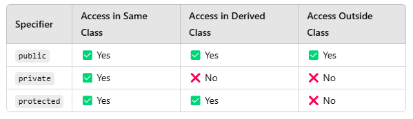
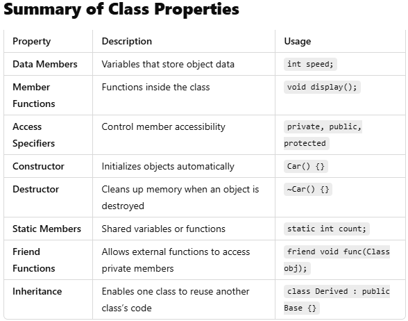

Why Was OOP Introduced?

Reasons for Introducing OOP:

1. Overcoming Limitations of Procedural Programming

2. Procedural programming lacks data security and modularity.

3. No direct way to bind data and functions together.

4. Large projects become hard to manage.

5. Encapsulation (Data Hiding)

6. Prevents unauthorized access to data.

Example: Using private variables in a class and accessing them through public methods.

7. Code Reusability (Inheritance)

Allows child classes to reuse parent class functionalities.

8. Reduces redundant code.

9. Modularity and Maintainability

10. Helps organize code into logical modules.

11. Enhances debugging and improves team collaboration.

12. Abstraction (Hiding Complexity)
13. Exposes only necessary parts of a class.

Example: ATM machines hide internal banking logic from users.

14. Polymorphism (Flexibility in Code)

15. Allows multiple functions to have the same name but different behaviors.

Example: Function overloading and method overriding.


## **Detailed Explanation of Every Property of a Class in C++**
In **C++**, a class is a user-defined data type that encapsulates **data members** (variables) and **member functions** (methods) to operate on those data members. A class provides the blueprint for creating **objects**.

---

# **1. Properties of a Class**
### **A class consists of:**
1. **Data Members (Attributes)**
2. **Member Functions (Methods)**
3. **Access Specifiers (`public`, `private`, `protected`)**
4. **Constructors (Special methods for initialization)**
5. **Destructors (Special method for cleanup)**
6. **Static Members (Shared by all objects)**
7. **Friend Functions (Allow external access)**
8. **Inheritance (Code reusability and hierarchy)**

---

## **2. Explanation of Each Property with Examples**

### **1. Data Members (Attributes)**
- **Definition:** Variables that store the state or properties of an object.

### **2. Member Functions (Methods)**
- **Definition:** Functions that define the behavior of a class.
- **Types:**
  - **Inside Class Definition**
  - **Outside Class Definition**


---

### **3. Access Specifiers**
Access specifiers control **who** can access the members of the class.



---

### **4. Constructors (Special Methods for Initialization)**
A **constructor** is a special function that is called automatically when an object is created.

#### **Types of Constructors**
1. **Default Constructor** – No parameters.
2. **Parameterized Constructor** – Accepts parameters.
3. **Copy Constructor** – Creates a copy of another object.


### **5. Destructor (Special Method for Cleanup)**
- **Definition:** Destructor is called **automatically** when an object is destroyed.
- **Syntax:** `~ClassName()`
- **Example:**
```cpp
class Car {
public:
    Car() { cout << "Car object created!" << endl; }
    ~Car() { cout << "Car object destroyed!" << endl; }
};

int main() {
    Car myCar;
} // Destructor called here
```

---

### **6. Static Members**
Static members belong **to the class, not an instance**.
- **Static Variables** are shared among all objects.
- **Static Functions** can only access static members.

#### **Example**
```cpp
class Counter {
public:
    static int count; // Static Variable

    Counter() {
        count++;
    }

    static void showCount() { // Static Function
        cout << "Count: " << count << endl;
    }
};

int Counter::count = 0; // Initialize Static Variable
```

---

### **7. Friend Functions (Access Private Members)**
A **friend function** is not a member of the class but can **access private members**.

#### **Example**
```cpp
class Box {
private:
    int width;
public:
    Box(int w) { width = w; }
    friend void printWidth(Box);
};

void printWidth(Box b) {
    cout << "Width: " << b.width << endl; // Access private data
}
```

---

### **8. Inheritance (Code Reusability)**
Inheritance allows a class to **inherit properties and behaviors** from another class.

#### **Example: Single Inheritance**
```cpp
class Vehicle {
public:
    int wheels;
    void move() { cout << "Vehicle is moving" << endl; }
};

class Car : public Vehicle {
public:
    string brand;
};
```

---


